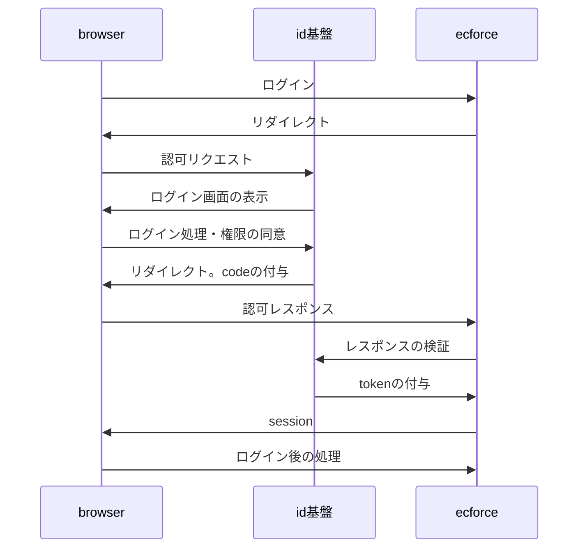
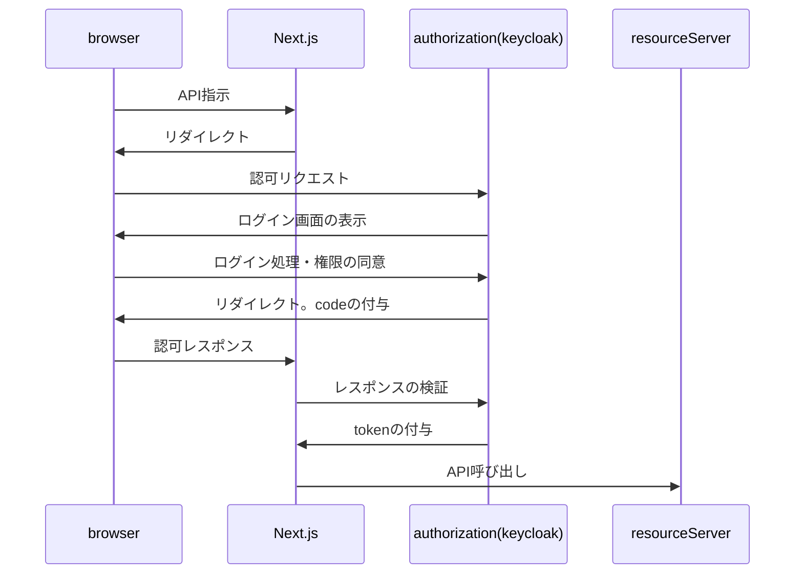
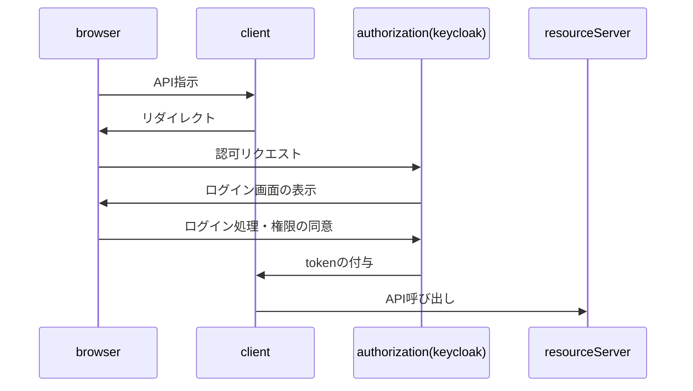
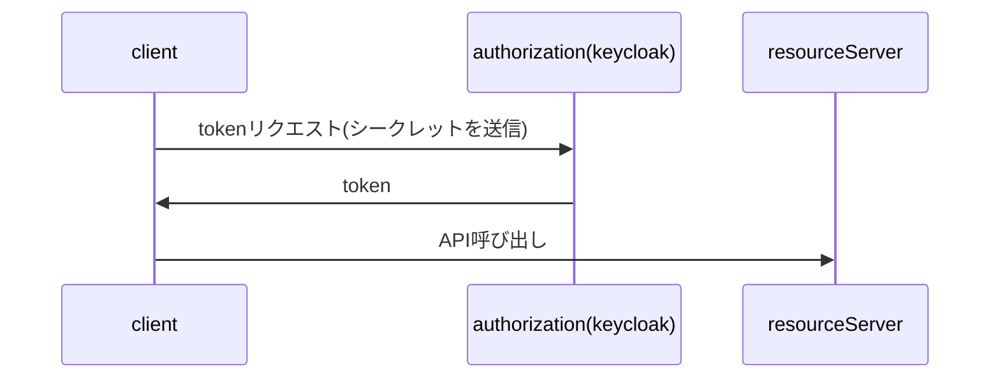
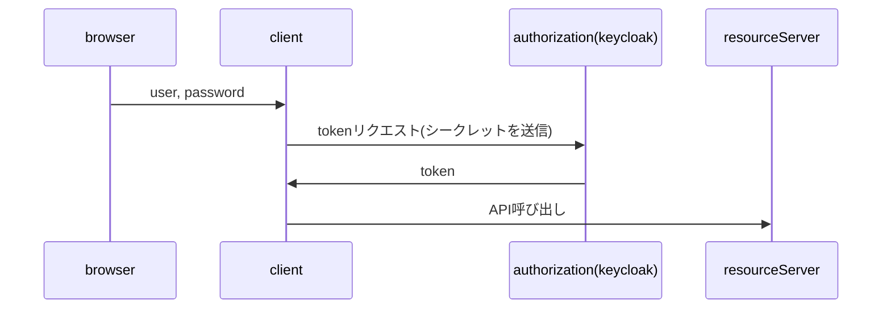

- 認可コードフロー

```mermaid
sequenceDiagram
  participant browser
	participant keycloak as id基盤
	participant client as ecforce 
	browser ->> client: ログイン
	client ->> browser: リダイレクト
	browser ->> keycloak: 認可リクエスト
	keycloak ->> browser: ログイン画面の表示
	browser ->> keycloak: ログイン処理・権限の同意
	keycloak ->> browser: リダイレクト。codeの付与
	browser ->> client: 認可レスポンス
	client ->> keycloak: レスポンスの検証
	keycloak ->> client: tokenの付与
	client ->> browser: session
	browser ->> client: ログイン後の処理
```

```mermaid
sequenceDiagram
  participant browser
	participant client as Next.js
	participant keycloak as authorization(keycloak)
	participant resourceServer
	browser ->> client: API指示
	client ->> browser: リダイレクト
	browser ->> keycloak: 認可リクエスト
	keycloak ->> browser: ログイン画面の表示
	browser ->> keycloak: ログイン処理・権限の同意
	keycloak ->> browser: リダイレクト。codeの付与
	browser ->> client: 認可レスポンス
	client ->> keycloak: レスポンスの検証
	keycloak ->> client: tokenの付与
	client ->> resourceServer: API呼び出し
```

- インプリシットフロー

```mermaid
sequenceDiagram
  participant browser
	participant client
	participant keycloak as authorization(keycloak)
	participant resourceServer
	browser ->> client: API指示
	client ->> browser: リダイレクト
	browser ->> keycloak: 認可リクエスト
	keycloak ->> browser: ログイン画面の表示
	browser ->> keycloak: ログイン処理・権限の同意
	keycloak ->> client: tokenの付与
	client ->> resourceServer: API呼び出し
```

- クライアントクレデンシャルフロー	
  - clientは事前にシークレットを保持している

```mermaid
sequenceDiagram
	participant client
	participant keycloak as authorization(keycloak)
	participant resourceServer
	client ->> keycloak: tokenリクエスト(シークレットを送信)
	keycloak ->> client: token
	client ->> resourceServer: API呼び出し
```

- リソースオーナーパスワードクレデンシャルズフロー
  - clientは事前にシークレットを保持している

```mermaid
sequenceDiagram
  participant browser
	participant client
	participant keycloak as authorization(keycloak)
	participant resourceServer
	browser ->> client: user, password
	client ->> keycloak: tokenリクエスト(シークレットを送信)
	keycloak ->> client: token
	client ->> resourceServer: API呼び出し
```
